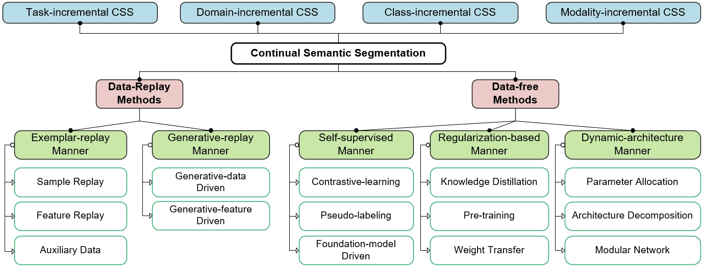
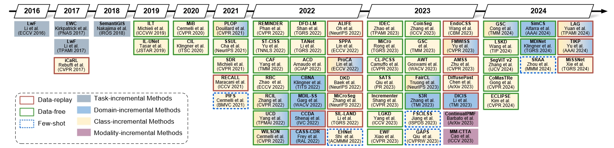

# SurveyCSS
A survey on Continual Semantic Segmentation

## Data-replay Approaches
### 2023
DiffusePast: [DiffusePast: Diffusion-based Generative Replay for Class Incremental Semantic Segmentation](https://arxiv.org/pdf/2308.01127.pdf) \
FMWILSS: [Foundation Model Drives Weakly Incremental Learning for Semantic Segmentation](https://arxiv.org/abs/2302.14250) \

### 2022

### 2021

## Data-free Approaches

### 2023
IDEC: [Inherit With Distillation and Evolve With Contrast: Exploring Class Incremental Semantic Segmentation Without Exemplar Memory](https://ieeexplore.ieee.org/abstract/document/10120962)\
MiCro: \
CL-PCSS: \
AWT: \
EWF: \
GSC: \
SATS: \

### 2022

### 2021

