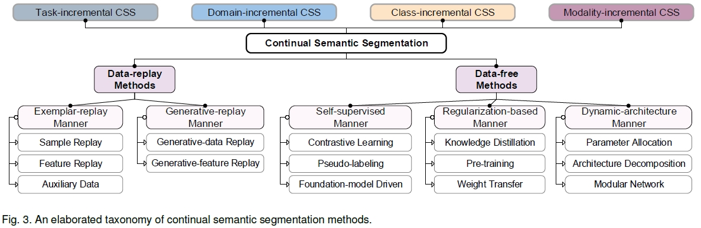
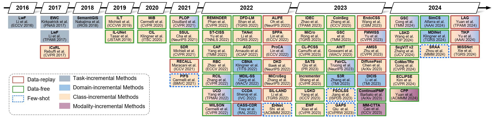

# SurveyCSS
A survey on Continual Semantic Segmentation

## Data-replay Approaches
### 2023
DiffusePast: [DiffusePast: Diffusion-based Generative Replay for Class Incremental Semantic Segmentation.] [[pdf]](https://arxiv.org/pdf/2308.01127.pdf) \
FMWILSS: [Foundation Model Drives Weakly Incremental Learning for Semantic Segmentation.][CVPR 2023] [[pdf]](https://arxiv.org/abs/2302.14250) \
AMSS: [Continual Semantic Segmentation With Automatic Memory Sample Selection] [CVPR 2023] [[pdf]]()\

### 2022
ProCA: [Prototype-guided continual adaptation for class-incremental unsupervised domain adaptation] [ECCV 2022] [[pdf]]()\
SPPA: [Continual Semantic Segmentation via Structure Preserving and Projected Feature Alignment] [ECCV 2022] [[pdf]]() \
ALIFE: [Alife: Adaptive logit regularizer and feature replay for \textsc{incre}mental semantic segmentation] [NeurIPS 2022] [[pdf]]() \
DKD: [Decomposed knowledge distillation for class-incremental semantic segmentation] [NeurIPS 2022] [[pdf]]()\

### 2021

## Data-free Approaches

### 2023
GSC: [Gradient-Semantic Compensation for Incremental Semantic Segmentation.] [[pdf]](https://browse.arxiv.org/pdf/2307.10822.pdf)\
IDEC: [Inherit With Distillation and Evolve With Contrast: Exploring Class Incremental Semantic Segmentation Without Exemplar Memory.] [TPAMI 2023] [[pdf]](https://ieeexplore.ieee.org/abstract/document/10120962)\
MiCro: [MiCro: Modeling Cross-Image Semantic Relationship Dependencies for Class-Incremental Semantic Segmentation in Remote Sensing Images.][TGRS 2023][[pdf]](https://ieeexplore.ieee.org/abstract/document/10188852)\
CL-PCSS: [Continual Learning for LiDAR Semantic Segmentation: Class-Incremental and Coarse-to-Fine strategies on Sparse Data] [CVPR 2023] [[pdf]]()\
AWT: [Attribution-aware Weight Transfer: A Warm-Start Initialization for Class-Incremental Semantic Segmentation] [WACV 2023] [[pdf]]()\
EWF: [Endpoints Weight Fusion for Class Incremental Semantic Segmentation][CVPR 2023][[pdf]]()\
SATS: [SATS: Self-attention transfer for continual semantic segmentation][PR 2023]\
Incrementer: [Incrementer: Transformer for Class-Incremental Semantic Segmentation with Knowledge Distillation Focusing on Old Class][CVPR 2023]\
### 2022
EHNet: [Incremental Few-Shot Semantic Segmentation via Embedding Adaptive-Update and Hyper-class Representation] [ACMMM 2022] [[pdf]]()\
BAFFT: [Birds of a Feather Flock Together: Category-Divergence Guidance for Domain Adaptive Segmentation] [TIP 2022] [[pdf]]()\
WILSON: [Incremental Learning in Semantic Segmentation From Image Labels] [CVPR 2022] [[pdf]]()\
RBC: [RBC: Rectifying the Biased Context in Continual Semantic Segmentation.] [ECCV 2022] [[pdf]]()\
CBNA: [Continual BatchNorm Adaptation (CBNA) for Semantic Segmentatio] [TITS 2022] [[pdf]]()\
ACD: [A contrastive distillation approach for incremental semantic segmentation in aerial images] [ICIAP 2022] [[pdf]]()\
TANet: [Class-Incremental Learning Network for Small Objects Enhancing of Semantic Segmentation in Aerial Imagery] [TGRS 2022] [[pdf]]()\

### 2021

