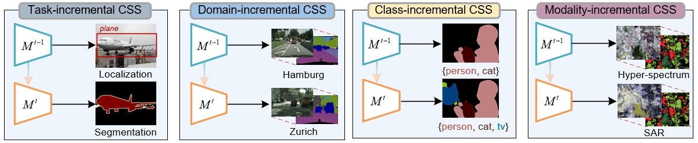

# <div align='center'> SurveyCSS (Continuously updating) </div>



## Paper
[A Survey on Continual Semantic Segmentation: Theory, Challenge, Method and Application](https://browse.arxiv.org/abs/2310.14277)

## <div align='center'> Data-replay Approaches </div>
### 2023
- Replaying Styles for Continual Semantic Segmentation Across Domains [ACPR 2023] [[paper]](https://link.springer.com/chapter/10.1007/978-3-031-47637-2_23) 
- FairCL: [Fairness Continual Learning Approach to Semantic Scene Understanding in Open-World Environments] [NeurIPS 2023] [[paper]](https://arxiv.org/abs/2305.15700) 
- DiffusePast: [DiffusePast: Diffusion-based Generative Replay for Class Incremental Semantic Segmentation] [ArXiv 2023] [[paper]](https://arxiv.org/pdf/2308.01127) 
- FMWILSS: [Foundation Model Drives Weakly Incremental Learning for Semantic Segmentation] [CVPR 2023] [[paper]](https://arxiv.org/abs/2302.14250) 
- AMSS: [Continual Semantic Segmentation With Automatic Memory Sample Selection] [CVPR 2023] [[paper]](https://openaccess.thecvf.com/content/CVPR2023/html/Zhu_Continual_Semantic_Segmentation_With_Automatic_Memory_Sample_Selection_CVPR_2023_paper.html) 
- RECALL+: [Adversarial Web-based Replay for Continual Learning in Semantic Segmentation] [ArXiv 2023] [[paper]](https://browse.arxiv.org/pdf/2309.10479) 
- EndoCSS: [Rethinking exemplars for continual semantic segmentation in endoscopy scenes: Entropy-based mini-batch pseudo-replay] [CBM 2023] [[paper]](https://browse.arxiv.org/pdf/2308.14100) 
- Domain-Incremental Cardiac Image Segmentation With Style-Oriented Replay and Domain-Sensitive Feature Whitening [TMI 2023] [[paper]](https://ieeexplore.ieee.org/document/9908146) 
- GarDA: [Generative appearance replay for continual unsupervised domain adaptation] [ArXiv 2023] [[paper]](https://arxiv.org/abs/2301.01211) 

### 2022
- ProCA: [Prototype-guided continual adaptation for class-incremental unsupervised domain adaptation] [ECCV 2022] [[paper]](https://browse.arxiv.org/pdf/2207.10856.pdf) [[code]](https://github.com/Hongbin98/ProCA)  
- SPPA: [Continual Semantic Segmentation via Structure Preserving and Projected Feature Alignment] [ECCV 2022] [[paper]](https://www.ecva.net/papers/eccv_2022/papers_ECCV/papers/136890341.pdf) [[code]](https://github.com/AsteRiRi/SPPA)  
- ALIFE: [Alife: Adaptive logit regularizer and feature replay for incremental semantic segmentation] [NeurIPS 2022] [[paper]](https://proceedings.neurips.cc/paper_files/paper/2022/hash/5d516fc09b53e9a7fade4fbad703e686-Abstract-Conference.html) [[code]](https://github.com/cvlab-yonsei/ALIFE)  
- DKD: [Decomposed knowledge distillation for class-incremental semantic segmentation] [NeurIPS 2022] [[paper]](https://proceedings.neurips.cc/paper_files/paper/2022/hash/439bf902de1807088d8b731ca20b0777-Abstract-Conference.html) [[code]](https://github.com/cvlab-yonsei/DKD)  
- MicroSeg: [Mining Unseen Classes via Regional Objectness: A Simple Baseline for Incremental Segmentation] [NeurIPS 2022] [[paper]](https://proceedings.neurips.cc/paper_files/paper/2022/file/99b419554537c66bf27e5eb7a74c7de4-Paper-Conference.pdf) [[code]](https://github.com/zkzhang98/MicroSeg)
- CCDA: [Continual coarse-to-fine domain adaptation in semantic segmentation] [IVC 2022] [[paper]](https://doi.org/10.1016/j.imavis.2022.104426) 
- Continual Adaptation of Semantic Segmentation Using Complementary 2D-3D Data Representations [LRA 2022] [[apper]](https://ieeexplore.ieee.org/abstract/document/9874976) 

### 2021
- SSUL: [SSUL: Semantic Segmentation with Unknown Label for Exemplar-based Class-Incremental Learning] [NeurIPS 2021] [[paper]](https://proceedings.neurips.cc/paper/2021/hash/5a9542c773018268fc6271f7afeea969-Abstract.html) [[code]](https://github.com/clovaai/SSUL)  
- RECALL: [RECALL: Replay-based Continual Learning in Semantic Segmentation] [ICCV 2021] [[paper]](https://openaccess.thecvf.com/content/ICCV2021/papers/Maracani_RECALL_Replay-Based_Continual_Learning_in_Semantic_Segmentation_ICCV_2021_paper.pdf) [[code]](https://github.com/LTTM/RECALL)  
- FSS: [Prototype-based Incremental Few-Shot Semantic Segmentation] [BMVC 2021] [[paper]](https://arxiv.org/abs/2012.01415) [[code]](https://github.com/fcdl94/FSS)  


## <div align='center'> Data-free Approaches </div>

### 2023
- SDCL: [Subspace Distillation for Continual Learning] [[paper]](https://www.sciencedirect.com/science/article/pii/S0893608023004057) [[code]](https://github.com/csiro-robotics/SDCL)  
- IDEC: [Inherit With Distillation and Evolve With Contrast: Exploring Class Incremental Semantic Segmentation Without Exemplar Memory] [TPAMI 2023] [[paper]](https://ieeexplore.ieee.org/abstract/document/10120962) 
- CoinSeg: Contrast Inter- and Intra- Class Representations for Incremental Segmentation [ICCV 2023] [[paper]](https://arxiv.org/pdf/2310.06368v1.pdf) [[code]](https://github.com/zkzhang98/CoinSeg) 
- Class-incremental Continual Learning for Instance Segmentation with Image-level Weak Supervision. [ICCV 2023] [[paper]](https://openaccess.thecvf.com/content/ICCV2023/html/Hsieh_Class-incremental_Continual_Learning_for_Instance_Segmentation_with_Image-level_Weak_Supervision_ICCV_2023_paper.html) [[code]](https://github.com/AI-Application-and-Integration-Lab/CL4WSIS)  
- Effects of architectures on continual semantic segmentation. [ArXiv 2023] [[paper]](https://arxiv.org/abs/2302.10718)
- SegViT v2: [SegViTv2: Exploring Efficient and Continual Semantic Segmentation with Plain Vision Transformers] [ArXiv 2023] [[paper]](https://arxiv.org/abs/2306.06289) 
- LGKD: [Label-Guided Knowledge Distillation for Continual Semantic Segmentation on 2D Images and 3D Point Clouds] [ICCV 2023] [[paper]](https://openaccess.thecvf.com/content/ICCV2023/html/Yang_Label-Guided_Knowledge_Distillation_for_Continual_Semantic_Segmentation_on_2D_Images_ICCV_2023_paper.html) 
- Preparing the Future for Continual Semantic Segmentation. [ICCV 2023] [[paper]](https://openaccess.thecvf.com/content/ICCV2023/html/Lin_Preparing_the_Future_for_Continual_Semantic_Segmentation_ICCV_2023_paper.html) 
- GSC: [Gradient-Semantic Compensation for Incremental Semantic Segmentation] [ArXiv 2023] [[paper]](https://arxiv.org/abs/2307.10822)  
- MiCro: [MiCro: Modeling Cross-Image Semantic Relationship Dependencies for Class-Incremental Semantic Segmentation in Remote Sensing Images.] [TGRS 2023] [[paper]](https://ieeexplore.ieee.org/abstract/document/10188852)  
- CL-PCSS: [Continual Learning for LiDAR Semantic Segmentation: Class-Incremental and Coarse-to-Fine strategies on Sparse Data] [CVPR 2023] [[paper]](https://openaccess.thecvf.com/content/CVPR2023W/CLVision/html/Camuffo_Continual_Learning_for_LiDAR_Semantic_Segmentation_Class-Incremental_and_Coarse-To-Fine_Strategies_CVPRW_2023_paper.html) 
- AWT: [Attribution-aware Weight Transfer: A Warm-Start Initialization for Class-Incremental Semantic Segmentation] [WACV 2023] [[paper]](https://openaccess.thecvf.com/content/WACV2023/htmlGoswami_Attribution-Aware_Weight_Transfer_A_Warm-Start_Initialization_for_Class-Incremental_Semantic_Segmentation_WACV_2023_paper.html) 
- EWF: [Endpoints Weight Fusion for Class Incremental Semantic Segmentation] [CVPR 2023] [[paper]](https://openaccess.thecvf.com/content/CVPR2023/papers/Xiao_Endpoints_Weight_Fusion_for_Class_Incremental_Semantic_Segmentation_CVPR_2023_paper.pdf) [[code]](https://github.com/schuy1er/EWF_official) 
- SATS: [SATS: Self-attention transfer for continual semantic segmentation] [PR 2023] [[paper]](https://browse.arxiv.org/pdf/2203.07667.pdf) [[code]](https://github.com/QIU023/SATS_Continual_Semantic_Seg)  
- Incrementer: [Incrementer: Transformer for Class-Incremental Semantic Segmentation with Knowledge Distillation Focusing on Old Class][CVPR 2023][[paper]](https://openaccess.thecvf.com/content/CVPR2023/html/Shang_Incrementer_Transformer_for_Class-Incremental_Semantic_Segmentation_With_Knowledge_Distillation_Focusing_CVPR_2023_paper.html)  
- S3R: [S3R: Shape and Semantics-Based Selective Regularization for Explainable Continual Segmentation Across Multiple Sites] [TMI 2023] [[paper]](https://ieeexplore.ieee.org/abstract/document/10078916) 
- ContinualPMF:[Continual Road-Scene Semantic Segmentation via Feature-Aligned Symmetric Multi-Modal Network] [ArXiv 2023] [[paper]](https://arxiv.org/abs/2308.04702) 
- CoMFormer: [CoMFormer: Continual Learning in Semantic and Panoptic Segmentation] [CVPR 2023] [[paper]](https://arxiv.org/abs/2211.13999)  
- DILRS: [DILRS: Domain-Incremental Learning for Semantic Segmentation in Multi-Source Remote Sensing Data] [Remote Sensing 2023] [[paper]](https://www.mdpi.com/2072-4292/15/10/2541) 
- RaSP: [RaSP: Relation-aware Semantic Prior for Weakly Supervised Incremental Segmentation]  [ArXiv 2023] [[paper]](https://arxiv.org/abs/2305.19879) 
- Efficient Multi-Grained Knowledge Reuse for Class Incremental Segmentation. [ArXiv 2023] [[paper]](https://arxiv.org/pdf/2306.02027.pdf) 

### 2022
- iFS-RCNN: An Incremental Few-shot Instance Segmenter [CVPR 2022] [[paper]](https://arxiv.org/pdf/2205.15562.pdf) 
- WILSON: [Incremental Learning in Semantic Segmentation From Image Labels] [CVPR 2022] [[paper]](https://openaccess.thecvf.com/content/CVPR2022/html/Cermelli_Incremental_Learning_in_Semantic_Segmentation_From_Image_Labels_CVPR_2022_paper.html) [[code]](https://github.com/fcdl94/WILSON) 
- RBC: [RBC: Rectifying the Biased Context in Continual Semantic Segmentation] [ECCV 2022] [[paper]](https://browse.arxiv.org/pdf/2203.08404.pdf) [[code]](https://github.com/dcdcvgroup/RBC) 
- CBNA: [Continual BatchNorm Adaptation (CBNA) for Semantic Segmentation] [TITS 2022] [[paper]](https://ieeexplore.ieee.org/abstract/document/9843858) [[code]](https://github.com/ifnspaml/CBNA)  
- ACD: [A contrastive distillation approach for incremental semantic segmentation in aerial images] [ICIAP 2022] [[paper]](https://browse.arxiv.org/pdf/2112.03814.pdf) [[code]](https://github.com/edornd/contrastive-distillation) 
- TANet: [Class-Incremental Learning Network for Small Objects Enhancing of Semantic Segmentation in Aerial Imagery] [TGRS 2022] [[paper]](https://ieeexplore.ieee.org/abstract/document/9594782) 
- ST-CISS: [Self-Training for Class-Incremental Semantic Segmentation] [TNNLS 2022] [[paper]](https://ieeexplore.ieee.org/abstract/document/9737321) 
- RCIL: [Representation Compensation Networks for Continual Semantic Segmentation] [CVPR 2022] [[paper]](https://openaccess.thecvf.com/content/CVPR2022/html/Zhang_Representation_Compensation_Networks_for_Continual_Semantic_Segmentation_CVPR_2022_paper.html) 
- CAF：[Continual attentive fusion for incremental learning in semantic segmentation] [TMM 2022] [[paper]](https://ieeexplore.ieee.org/abstract/document/9757872) 
- UCD: [Uncertainty-aware Contrastive Distillation for Incremental Semantic Segmentation] [TPAMI 2022] [[paper]](https://ieeexplore.ieee.org/abstract/document/9745778) 
- REMINDER: [Class Similarity Weighted Knowledge Distillation for Continual Semantic Segmentation] [CVPR 2022] [[paper]](https://openaccess.thecvf.com/content/CVPR2022/html/Phan_Class_Similarity_Weighted_Knowledge_Distillation_for_Continual_Semantic_Segmentation_CVPR_2022_paper.html) 
- DFD-LM: [Class-Incremental Learning for Semantic Segmentation in Aerial Imagery via Distillation in All Aspects] [TGRS 2022] [[paper]](https://ieeexplore.ieee.org/abstract/document/9648310) 


### 2021
- SDR: [Continual Semantic Segmentation via Repulsion-Attraction of Sparse and Disentangled Latent Representations] [CVPR 2021] [[paper]](https://openaccess.thecvf.com/content/CVPR2021/html/Michieli_Continual_Semantic_Segmentation_via_Repulsion-Attraction_of_Sparse_and_Disentangled_Latent_CVPR_2021_paper.html?ref=https://githubhelp.com) 
- PLOP: [PLOP: Learning without Forgetting for Continual Semantic Segmentation] [CVPR 2021] [[paper]](https://openaccess.thecvf.com/content/CVPR2021/html/Douillard_PLOP_Learning_Without_Forgetting_for_Continual_Semantic_Segmentation_CVPR_2021_paper.html) 


### 2020
- MiB: [Modeling the Background for Incremental Learning in Semantic Segmentation] [CVPR 2020] [[paper]](https://openaccess.thecvf.com/content_CVPR_2020/html/Cermelli_Modeling_the_Background_for_Incremental_Learning_in_Semantic_Segmentation_CVPR_2020_paper.html) 

### 2019
- ILT: [Incremental Learning Techniques for Semantic Segmentation] [ICCVW 2019] [[paper]](https://openaccess.thecvf.com/content_ICCVW_2019/html/TASK-CV/Michieli_Incremental_Learning_Techniques_for_Semantic_Segmentation_ICCVW_2019_paper.html) 

## <div align='center'> Few-shot CSS </div>
- SRAA: [Advancing Incremental Few-shot Semantic Segmentation via Semantic-guided Relation Alignment and Adaptation] [ArXiv 2023] [[paper]](https://arxiv.org/abs/2305.10868)
- FSCILSS: [Few-Shot Class-Incremental Semantic Segmentation via Pseudo-Labeling and Knowledge Distillation] [ISPDS 2023] [[paper]](https://ieeexplore.ieee.org/abstract/document/10235731)
- GAPS: [GAPS: Few-Shot Incremental Semantic Segmentation via Guided Copy-Paste Synthesis] [CVPRW 2023] [[paper]](https://motion.cs.illinois.edu/papers/CVPRWorkshop2023-Qiu-FewShotSegmentation.pdf)
- EHNet: [Incremental Few-Shot Semantic Segmentation via Embedding Adaptive-Update and Hyper-class Representation] [ACM MM 2022] [[paper]](https://dl.acm.org/doi/abs/10.1145/3503161.3548218)
- PIFS: [Prototype-based Incremental Few-Shot Semantic Segmentation] [BMVC 2021] [[paper]](https://arxiv.org/abs/2012.01415)

## <div align='center'> Specific Applications </div>
- Federated Incremental Semantic Segmentation. [CVPR 2023] [[paper]](https://arxiv.org/abs/2304.04620) [[code]](https://github.com/JiahuaDong/FISS)
- Principles of Forgetting in Domain-Incremental Semantic Segmentation in Adverse Weather Conditions [CVPR 2023] [[paper]](https://arxiv.org/abs/2303.14115)
- Continual segment: Towards a single, unified and accessible continual segmentation model of 143 whole-body organs in ct scans. [ICCV 2023] [[paper]](https://arxiv.org/abs/2302.00162)
- Continual Nuclei Segmentation via Prototype-wise Relation Distillation and Contrastive Learning. [TMI 2023] [[paper]](https://ieeexplore.ieee.org/abstract/document/10227350)
- Continual learning for abdominal multi-organ and tumor segmentation. [MICCAI 2023] [[paper]](https://link.springer.com/chapter/10.1007/978-3-031-43895-0_4)

## <div align='center'> Reproductions </div>
### Class-incre. CSS Performance 
The evaluation of anti-forgetting ability and robustness of CSS methods.

### Class-incre. CSS Visualization
Here are some qualitative visualizations of recent CSS methods.


### Interpretability Analysis
Feature-based visualization is an explicit way to visualize the semantic clusters during CL steps. For example, TSNE and CAM-series are potential manners to assist the result analysis.

### Cite this repo
If this project is mentioned in other areas, please cite it as
```
@article{yuan2023survey,
  title={A Survey on Continual Semantic Segmentation: Theory, Challenge, Method and Application},
  author={Yuan, Bo and Zhao, Danpei},
  journal={arXiv preprint arXiv:2310.14277},
  year={2023}
}
```

## TODO
* [ ]  Method characteristics summary
* [ ]  Performance comparison
* [ ]  Roadmap update

